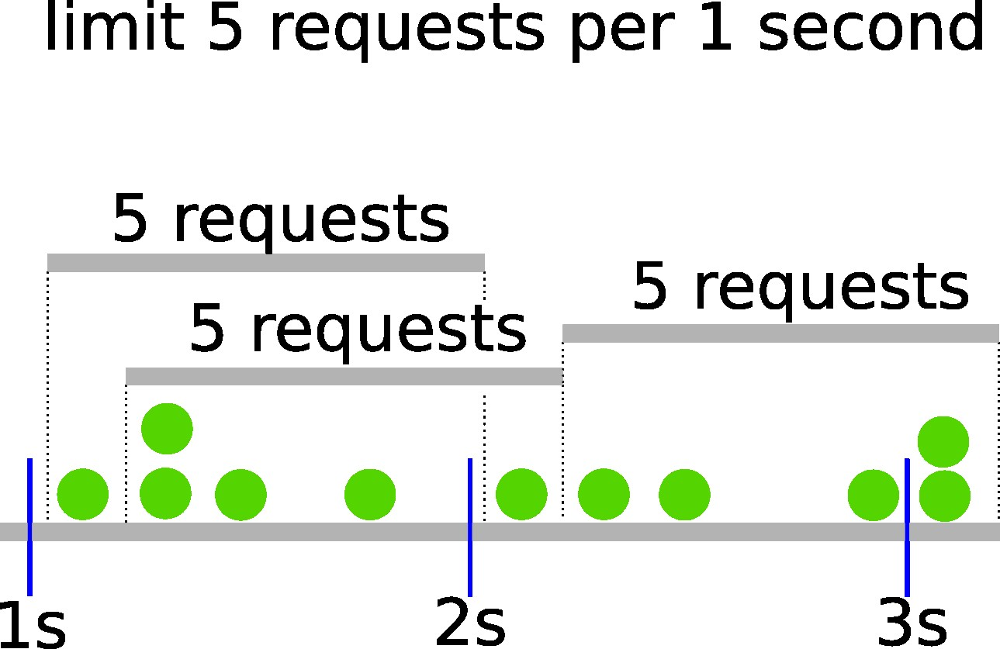

# Rate limiter with sliding window algorithm

[](https://github.com/axel-n/limiter-sliding-window/actions/workflows/tests.yml)

## Why need another rate limiter?
- this rate limiter is based on the algorithm sliding window
- not found any solution in popular libraries (bucket4j, resilience4j, guava)

## Briefly about the problem
Some resources ([example1](https://www.bitmex.com/app/restAPI#Limits), [example2](https://binance-docs.github.io/apidocs/spot/en/#limits)) has some limits  for accept user requests.

So application need to know (fast, without sent packets to any additional system) - can they send request or wait or skip

## How to use 
### add dependency for Maven 
```
<dependency>
    <groupId>io.github.axel-n</groupId>
    <artifactId>limiter-sliding-window</artifactId>
    <version>0.1</version>
</dependency>
```

### add dependency for Gradle
```
compile "io.github.axel-n:limiter-sliding-window:0.1"
```

## How it works sliding window algorithm



## Plans
- [x] integrate deploy to maven repository
- [x] add example without spring boot
- [ ] add methods for run something with limiter wrapper 
- [ ] add tests in concurrency execution
- [ ] add example with spring boot
- [ ] add usage with annotation
- [ ] add ability setup several limiters (for example 30 requests per 1 minute and 5 requests per second) 
- [ ] add integration with monitoring 